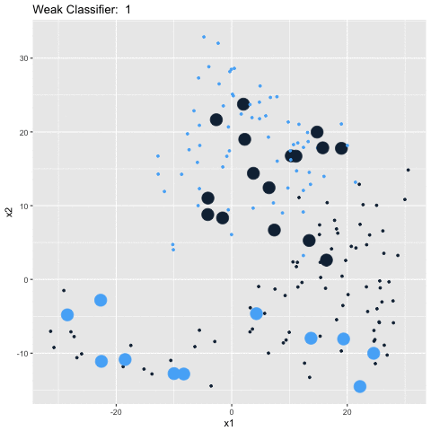

<style>

.storyboard-nav .sbframelist {
        margin: 0 auto;
        width: 94%;
        height: 50px;
        overflow: hidden;
        text-shadow: none;
        margin-bottom: 8px;
}

.storyboard-nav .sbprev, .storyboard-nav .sbnext  {
        float: right;
        width: 2%;
        height: 50px;
        font-size: 25px;
    }

</style>

### Adaptive Boosting

<p align=justify><font size= 4.5> What is AdaBoost?<br><br>

* The term AdaBoost comes from the phrase **Ada**ptive **Boost**ing. 

* This refers to a family of algorithms that create a strong classifier with a   
 **weighted combination** of weak classifiers. 

* A weak classifier is any decision rule that performs better than random guessing.   

* At each iteration, examples misclassified by the particular weak classifier are   
  upweighted or **boosted** before training the next weak classifier. 

* The intuition behind this is to  
    + aggregate simple rules into a complex function and
    + *boost* incorrect classifications to gain more information
</font></p>

### Dataset

<p align=justify><font size= 4.5> Let's pick a sample dataset. <br><br>

* For illustrative purposes, I use a dataset hosted by the Python package `scikitlearn`.  

* It consists of 8x8 images of digits from 0 through 9.   

* We subset out digits `1` and `8` to illustrate a binary classification problem.   

* Each digit has 180 observations. So, we have a well-balanced dataset of 360 observations.  

* Henceforth, `1` will be indicated by blue points and `8` by black points.

</font></p>

### The Algorithm

<p align=justify><font size= 4.25> Let's go through the algorithm. <br><br>

Assume a binary classification problem for the purposes of illustration.      

We want to identify observations as being either black or blue.  


At each iteration t,  

*  **Learn a simple rule** $h_{t}$ from the weighted training examples. 
    + In this case, each 'simple rule' is a decision stump.
    + In the first iteration, all examples are weighted equally.  
    
*  **Assign a weight** to $h_{t}$ that is proportional to its accuracy. 
    + If $h_{t}$ has accuracy lower than 50%, we flip its sign - i.e., we convert   
    a classifier with 40% accuracy to one with 60% accuracy by flipping the sign.
    + If $h_{t}$ has 50% accuracy, we assign it a weight of 0 - it gives us no useful information.   

    
*  Upweight or **boost examples misclassified** by $h_{t}$  


Finally, we aggregate the weak classifiers into a weighted sum to produce a strong classifier.

H(x) = sign($\sum_{t=1}^n\alpha_{t}h_{t}(x)$)

</font></p>

### Iteration #1 {data-commentary-width=350}

```{r}
library(dplyr)
library(ggplot2)
library(tweenr)
library(gganimate)
library(gridExtra)

one_frame <- function(i) {

  y <- read.table(file = paste('Iterations/data',i,'y.txt',sep = ""))
  x1 <- read.table(file = paste('Iterations/data',i,'x1.txt',sep = ""))
  x2 <- read.table(file = paste('Iterations/data',i,'x2.txt',sep = ""))
  preds <- read.table(file = paste('Iterations/data',i,'p.txt',sep = ""))
  
  df <- cbind(x1,x2,preds,y)
  colnames(df) <- c('x1','x2','preds','y')
  df <- df %>% mutate(correct = if_else(y == preds, 0, 1))
  df$frame <- i
  #print(1-mean(df$correct))
  
  return(df)
}
df_weak <- one_frame(1)
for (i in 2:14){
  to_add <- one_frame(i)
  df_weak <- rbind(df_weak,to_add)
}

plot_one <- function(df){
  p <- ggplot(df_weak, aes(x1, x2, size = correct, color = preds)) +
  geom_point(show.legend = F)+
  ggtitle(label = paste('Accuracy: ', round(1-mean(df$correct),3)))+
        scale_size_continuous(range = c(1.5, 4))

  return(p)}

cum_1 <- ggplot(df_weak, aes(x1, x2, size = correct, color = preds, frame = frame)) +
  geom_point(show.legend = F) +
  ggtitle('Weak Classifier: ')+
    scale_size_continuous(range = c(1.5, 4))
#ggtitle(label = paste('Accuracy: ', round(1-mean(df$correct),3)))

#plot_one(one_frame(5,TRUE))
#gganimate(cum_1, interval = 2, '../weak.mp4')

a1<- one_frame(1)
p1 <- ggplot(a1, aes(x1, x2, size = correct, color = preds, frame = frame)) +
  geom_point(show.legend = F) +
  ggtitle(label = paste('Accuracy on Training Set ', round(1-mean(a1$correct),3)))+
    scale_size_continuous(range = c(1.5, 4))+
  theme(axis.text.y=element_blank())
  #

```

```{r}

one_frame_cumulative <- function(i) {
  y <- read.table(file = paste('Weighted/final_y',i,'.txt',sep = ""))
  x1 <- read.table(file = paste('Weighted/final_x1',i,'.txt',sep = ""))
  x2 <- read.table(file = paste('Weighted/final_x2',i,'.txt',sep = ""))
  preds <- read.table(file = paste('Weighted/final_preds',i,'.txt',sep = ""))
  
  df <- cbind(x1,x2,preds,y)
  colnames(df) <- c('x1','x2','preds','y')
  df <- df %>% mutate(correct = if_else(y == preds, 0, 1))
  df$frame <- i
  #print(1-mean(df$correct))
  
  return(df)
}

df <- one_frame_cumulative(1)
for (i in 2:14){
  to_add <- one_frame_cumulative(i)
  df <- rbind(df,to_add)
}

cum_2 <- ggplot(df, aes(x1, x2, size = correct, color = preds, frame = frame)) +
  geom_point(show.legend = F) +
  ggtitle('Weak Classifier: ')

#gganimate(cum_2, interval = 2,'weighted.mp4')


a2 <- one_frame_cumulative(1)
p2 <- ggplot(a2, aes(x1, x2, size = correct, color = preds, frame = frame)) +
  geom_point(show.legend = F) +
    ggtitle(label = paste('Accuracy on Test Set: ', round(1-mean(a2$correct),3)))+
        scale_size_continuous(range = c(1.5, 4))+
  theme(axis.text.y=element_blank())


#g<- grid.arrange(p1,p2,ncol = 2)
#ggsave('iteration1.png',g)

renderPlot({
  g<- grid.arrange(p1,p2,ncol = 2)
})
```

****

<p align=justify><font size= 3.5> Iteration #1 <br><br>

These graphs show accuracies on the training and test sets with the first weak classifier.  

Recall that we boost or increase the weights of misclassified examples for the next classifier.  

The magnified observations indicate misclassified data points that are up-weighted for the next weak learner.  

For example, the larger black circles are actually blue observations that have been mislabeled as black.  

Here, we see that the first weak classifer correctly identifies 84.8% of the training set and 78.7% of the test set.  

Now, we use the weighted set of observations to fit our next weak learner. Go on to the next slide!
<font></p>

### Iteration #2 {data-commentary-width=350}


```{r}

b1 <- one_frame(2)
p11 <- ggplot(b1, aes(x1, x2, size = correct, color = preds, frame = frame)) +
  geom_point(show.legend = F) +
  ggtitle(label = paste('Accuracy on Training Set ', round(1-mean(b1$correct),2)))+
    scale_size_continuous(range = c(1.5, 4))+
  theme(axis.text.y=element_blank())
```

```{r}
b2 <- one_frame_cumulative(3)
p22 <- ggplot(b2, aes(x1, x2, size = correct, color = preds, frame = frame)) +
  geom_point(show.legend = F) +
    ggtitle(label = paste('Accuracy on Test Set: ', round(1-mean(b2$correct),3)))+
        scale_size_continuous(range = c(1.5, 4))+
  theme(axis.text.y=element_blank())

renderPlot({
  
grid.arrange(p11,p22,ncol = 2)

  })

```

****

<p align=justify><font size= 3.5> Iteration #2 <br><br>

At the next iteration, we see that many of the points that were misclassified in the previous iteration are now correctly classified.   

However, we see that some examples that Iteration #1 got right, are now misclassified.   

Fret not. The idea is that so long as each weak learner is better than random, they will, together, converge to a strong learner.   

Notice that the accuracy on the test set has increased.   

We want, however, to wait for the accuracy on the test set to stabilize before we stop adding more weak learners.

<font></p>

### Iteration #3 {data-commentary-width=350}


```{r}
c1 <- one_frame(3)
p111 <- ggplot(c1, aes(x1, x2, size = correct, color = preds, frame = frame)) +
  geom_point(show.legend = F) +
  ggtitle(label = paste('Accuracy on Training Set ', round(1-mean(c1$correct),3)))+
    scale_size_continuous(range = c(1.5, 4))+
  theme(axis.text.y=element_blank())
```

```{r}
c2 <- one_frame_cumulative(4)
p222 <- ggplot(c2, aes(x1, x2, size = correct, color = preds, frame = frame)) +
  geom_point(show.legend = F) +
    ggtitle(label = paste('Accuracy on Test Set: ', round(1-mean(c2$correct),3)))+
        scale_size_continuous(range = c(1.5, 4))+
  theme(axis.text.y=element_blank())

renderPlot({
  
grid.arrange(p111,p222,ncol = 2)

  })

```

****

<p align=justify><font size= 3.5> Iteration #3 <br><br>

Let's look closely at one more weak learner before we move on to viewing them all at once.  

Note that even though accuracy on the training set is lower than in the previous iteration, accuracy on the test set has indeed improved.   

How do we know when to stop?  

There are a few ways to determine this. 

  * We could decide on a threshold and stop adding more learners when they don't increase testing accuracy beyond that value.  
  
  * We could decide based on computational resources available and stop after a predetermined number of learners.  
  
  * We could decide based on the specific metric the context of the problem demands to be optimized.  
  
  * Here, we stop when the testing accuracy starts to fall, after 14 iterations.
    
<font></p>

### All Iterations {data-commentary-width=250}


Weak Learners on Training Set |  Weighted Learners on Test Set
:-------------------------:|:-------------------------:
  |  

****

<p align=justify><font size= 3.5> All Iterations <br><br>

These animated images take us on a little journey through all the weak classifiers.    

The gif on the left shows each weak learner on the training set and the one on the right shows the weighted learner at that step on the test set.  

Notice how the number of big circles, i.e. the number of misclassified observations goes down as we go from classifier #1 to classifier #14!

Cool, no? 

<font></p>

###  Final Classification {data-commentary-width=350}


```{r}

d1 <- one_frame_cumulative(1)
d2 <- one_frame_cumulative(14)

pf1 <- ggplot(d1, aes(x1, x2, size = correct, color = preds, frame = frame)) +
  geom_point(show.legend = F) +
    ggtitle(label = paste('Accuracy on Test Set at Iteration #1 : ', round(1-mean(d1$correct),3)))+
        scale_size_continuous(range = c(1.5, 4))+
  theme(axis.text.y=element_blank())

pf2 <- ggplot(d2, aes(x1, x2, size = correct, color = preds, frame = frame)) +
  geom_point(show.legend = F) +
    ggtitle(label = paste('Accuracy on Test Set at Iteration #14 : ', round(1-mean(d2$correct),3)))+
        scale_size_continuous(range = c(1.5, 4))+
  theme(axis.text.y=element_blank())

renderPlot({
  
grid.arrange(pf1,pf2,ncol = 2)

  })

```

****

<p align=justify><font size= 3.5> Adaptive Boosting: Before and After <br><br>

Look how much better the accuracy has gotten!  

We started off with an accuracy of 78% and through a process of adaptive boosting, we've ended up with an accuracy of nearly 94%!

<font></p>